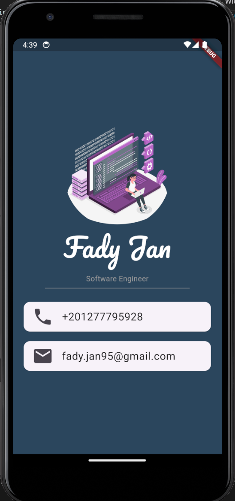

# Personal Profile App

This is a simple Flutter application developed as my first project using the Flutter framework. The app displays a personal profile, showcasing basic Flutter concepts and UI components.

## Features

- **Custom Styling**: The app uses custom color schemes and text styles.
- **Image Integration**: Utilization of `Image` widget to display profile picture.
- **Responsive Layout**: Implements a column layout that adjusts to the screen size.
- **Contact Information**: Displays contact details using `Card` and `ListTile`.

## Learned Concepts

- **Flutter Basics**: Understanding the fundamental concepts of Flutter, including the use of widgets and the basic structure of a Flutter app.
- **Stateless Widgets**: Learned about stateless widgets and their usage in creating immutable UI components.
- **Layout Widgets**: Gained experience in using layout widgets like `Column`, `Container`, and `SizedBox`.
- **Styling**: Explored how to style widgets using different properties like `color`, `fontSize`, `margin`, etc.
- **Asset Management**: Learned how to add and manage assets (like images) in a Flutter application.
- **Responsive Design**: Developed skills in creating a UI that adapts to different screen sizes.

## Screenshots

